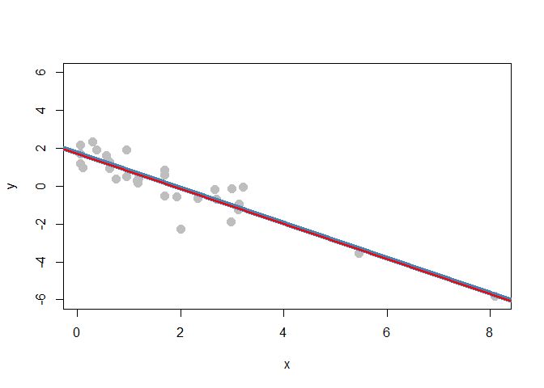
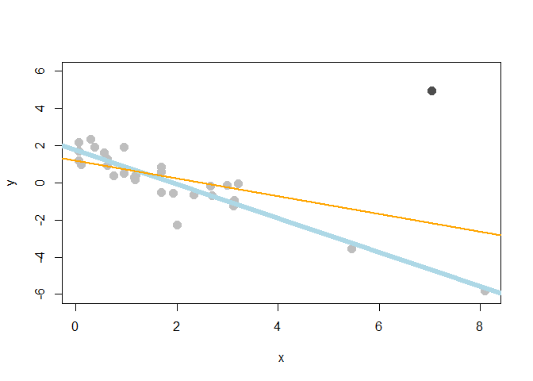

GRCI - README
================
Matias Salibian
July 25, 2016

Globally robust confidence intervals for simple linear regression models
========================================================================

This repository contains `R` code implementing the globally robust confidence intervals for the slope of a simple linear regression model as proposed in [Adrover, J. and Salibian-Barrera, M. (2010)](http://dx.doi.org/10.1016/j.csda.2009.05.005).

The functions are in the file `rci-pub.R`. The following example illustrates how to use this code. First, load the functions and generate a simple data set

``` r
source('rci-pub.R')
set.seed(123)
n <- 30
x <- rexp(n, rate=.5)
y <- 2 - x + rnorm(n, sd=.7)
```

A scatter plot of the data and both robust and least squares fits can be obtained with

``` r
plot(y ~ x, pch=19, col='gray', cex=1.5, ylim=c(-6, 6))
library(robustbase)
fit.rob <- lmrob(y~x)
fit.ls <- lm(y~x)
abline(fit.rob, lwd=6, col='steelblue')
abline(fit.ls, lwd=2, col='red')
```



The estimated coefficients are

``` r
coef(fit.rob)
```

    ## (Intercept)           x 
    ##    1.753117   -0.927370

``` r
coef(fit.ls)
```

    ## (Intercept)           x 
    ##   1.7209500  -0.9279946

The globally robust 95% confidence interval for the slope, protected against up to 5% of outliers in the data is

``` r
slope.ci(x=x, y=y, alpha=.05, epsilon=.05)
```

    ## [1] -1.1780857 -0.4728151

We now add outliers to the data.

``` r
ou <- rbinom(n, size=1, prob=.05)
y[ou==1] <- rnorm(sum(ou), mean=5, sd=.1)
x[ou==1] <- rnorm(sum(ou), mean=7, sd=.1)
```

The data and the LS and robust fits now look like this:

``` r
plot(y ~ x, pch=19, col='gray', cex=1.5, ylim=c(-6, 6))
points(y[ou==1] ~ x[ou==1], pch=19, col='gray30', cex=1.5)
fit.rob <- lmrob(y~x)
fit.ls <- lm(y~x)
abline(fit.rob, lwd=6, col='lightblue')
abline(fit.ls, lwd=2, col='orange')
```



The estimated coefficients are

``` r
coef(fit.rob)
```

    ## (Intercept)           x 
    ##   1.7654724  -0.9161235

``` r
coef(fit.ls)
```

    ## (Intercept)           x 
    ##   1.1975017  -0.4798898

The globally robust 95% confidence interval for the slope, protected against up to 5% of outliers in the data is

``` r
slope.ci(x=x, y=y, alpha=.05, epsilon=.05)
```

    ## [1] -1.0841055 -0.4194588
